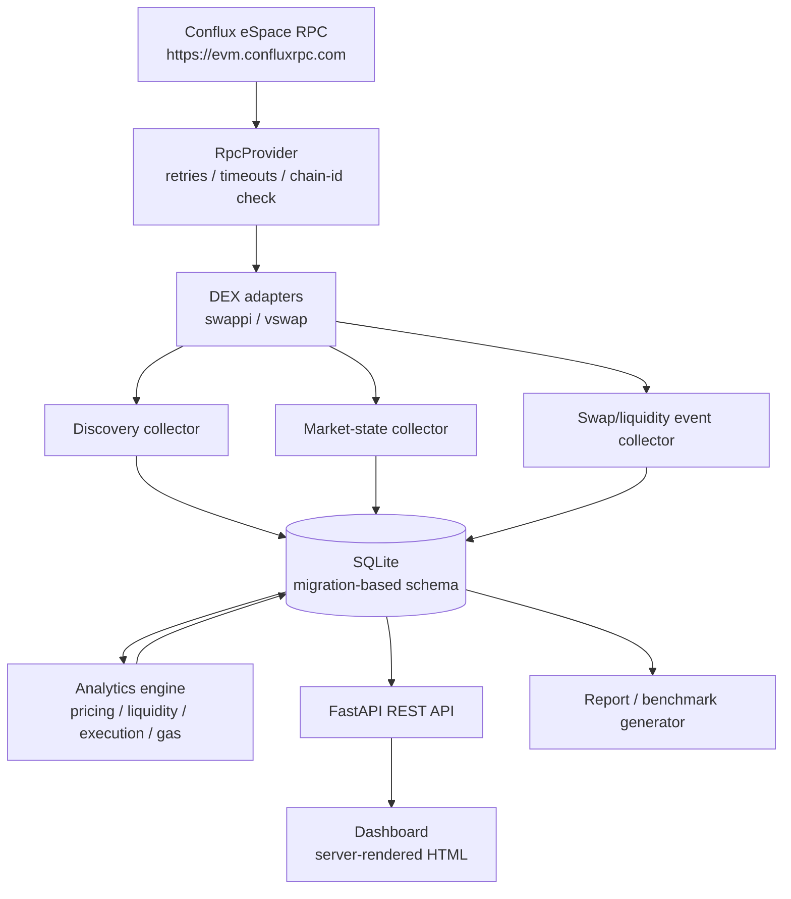

# Architecture

Conflux Liquidity & Execution Analytics is a modular monolith that collects
real Conflux eSpace on-chain data, normalises it, computes liquidity and
execution metrics, persists observations with full provenance, and serves them
through a REST API, a dashboard and reproducible reports.

## Layers

| Layer | Module | Responsibility |
|---|---|---|
| Configuration | `config.py`, `config/*.yaml` | Environment-driven network/RPC/DB/trade-size settings; DEX contract addresses with documented sources |
| RPC | `rpc/` | HTTP JSON-RPC with bounded retries, timeouts, rate-limit handling, capability probing and health checks |
| Chain primitives | `chain/` | ABI encode/decode (selectors computed from canonical signatures), address normalisation, ERC-20 metadata, bounded `eth_getLogs`, Decimal unit helpers |
| DEX adapters | `dex/` | Per-protocol implementations behind `DexAdapter` with explicit capability flags |
| Collectors | `collectors/` | Pool discovery, market-state snapshots, swap/liquidity event history, resumable checkpoints |
| Analytics | `analytics/` | Reference pricing, liquidity metrics, execution analysis, gas estimation — all Decimal arithmetic |
| Storage | `storage/` | SQLite via migrations; repositories; raw integers plus decimal-normalised values; provenance on every row |
| API / dashboard | `api/` | FastAPI endpoints and server-rendered dashboard mounted at `/dashboard` |
| Reporting | `reporting/` | CSV/JSON/Markdown report and live benchmark, all numbers from the database |
| CLI | `cli.py` | `health`, `discover`, `collect`, `analyze`, `report`, `benchmark`, `serve`, `api` |

## Key design decisions

* **Data-status discipline.** Every stored value carries a
  `data_status` (`verified`/`derived`/`estimated`/`simulated`/`unavailable`/
  `partial`/`error`/`stale`). Unavailable on-chain data is never substituted
  with an estimate; USD liquidity is null without a configured price source.
* **Adapter capabilities.** Adapters declare `supports_pool_state`,
  `supports_quotes`, `supports_swap_simulation`, `supports_historical_events`,
  `supports_fee_metadata`, `supports_gas_estimation`,
  `supports_direct_contract_calls`. The analytics layer refuses to invent
  behaviour for unsupported flags.
* **Address verification.** DEX contract addresses live in
  `config/dexes.yaml` with documented sources. Adapters verify each configured
  contract against the chain (code present + expected interface selectors
  respond) before it is used.
* **Raw quantities stay integers.** SQLite stores raw amounts as strings of
  integers; conversion to human units uses `Decimal` at precision 80. No
  binary floats touch token quantities.
* **Quote-method honesty.** Quotes record the mechanism that produced them:
  `router_quote` (protocol contract), `contract_simulation` (quoter contract),
  `pool_math` (local deterministic maths on verified state — never labelled a
  simulation), `sdk_quote`, or `no_support`.
* **Latest run separation.** `collection_runs` rows carry the run id; all
  observations reference it. The API exposes `/api/runs/latest` and can
  filter current state from historical observations.

## Adding a new DEX

1. Verify the protocol's contracts on ConfluxScan (eSpace) and record
   factory/router/pool addresses plus their sources in `config/dexes.yaml`.
2. Subclass `DexAdapter`, set capability flags to what the protocol actually
   supports, and implement `verify_contracts`, `discover_pools`,
   `get_pool_state` and (if supported) a quoting path.
3. Register the adapter class in `dex/registry.py` and add the DEX block to
   `config/dexes.yaml` (`enabled: false` until live verification passes).
4. Document the integration in `docs/dex-integrations.md`.

The analytics engine consumes only the adapter interface, so no analytics code
changes when a DEX is added.
